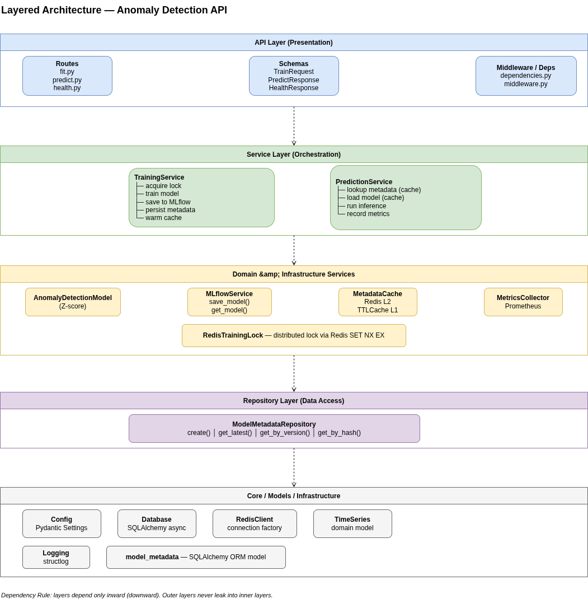
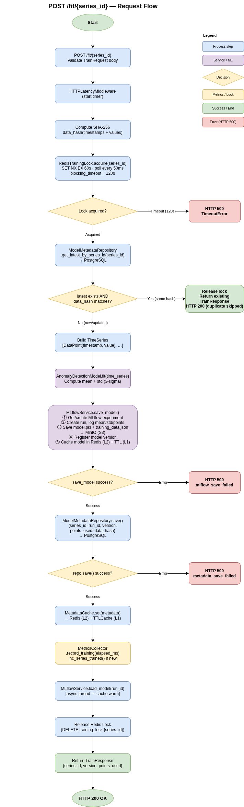
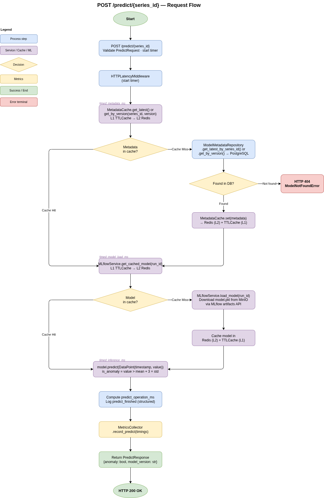
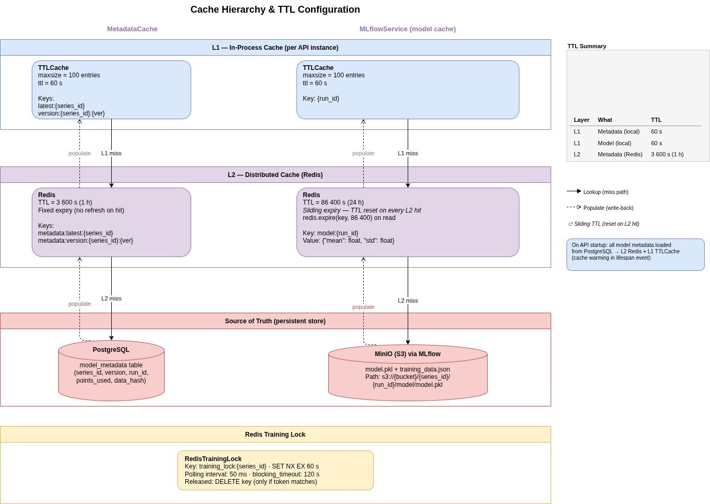

# Architecture — Time Series Anomaly Detection API

> Production-grade REST API for training and serving univariate time-series anomaly detection models per `series_id`, with versioning, artifact persistence, and real-time observability.

---

## 1. System Overview

The system exposes three core capabilities:

1. **Training** — Fit an `AnomalyDetectionModel` (Z-score) to a univariate time series identified by `series_id`.
2. **Inference** — Predict whether a new data point is anomalous for a given `series_id`, optionally pinning a specific model version.
3. **Observability** — Report system health and latency metrics (`avg`, `p95`) for training and inference.

Every trained model is versioned, serialized, and persisted. The API is fully asynchronous (FastAPI + Uvicorn) and designed to keep inference latency in the sub-millisecond range for cached models.



---

## 2. Technology Stack

| Layer               | Technology                       | Rationale                                                                                                                           |
| ------------------- | -------------------------------- | ----------------------------------------------------------------------------------------------------------------------------------- |
| API Framework       | FastAPI + Uvicorn                | Native `async`/`await`, automatic OpenAPI generation, strict Pydantic validation.                                                   |
| ORM & Migrations    | SQLAlchemy 2.0 (async) + Alembic | Type-safe async database access with Alembic for schema evolution.                                                                  |
| Metadata Store      | PostgreSQL                       | Durable, indexed storage for model metadata (`series_id`, `version`, `mlflow_run_id`, `trained_at`).                                |
| Artifact Store      | MLflow + MinIO                   | MLflow provides model registry and versioning; MinIO acts as S3-compatible object storage for serialized artifacts.                 |
| Distributed Cache   | Redis                            | Shared model and metadata cache across all API workers. Eliminates cold starts and cache fragmentation in multi-worker deployments. |
| Concurrency Control | Redis Distributed Lock           | Serializes concurrent training requests for the same series across all workers to prevent race conditions and phantom versions.     |
| Metrics             | Prometheus + Grafana             | Histogram-based latency tracking with a pre-provisioned Grafana dashboard.                                                          |
| Logging             | `structlog`                      | Structured, rotation-aware JSON logs for observability in containerized environments.                                               |
| Packaging           | `uv`                             | Fast, reproducible dependency resolution and lock files.                                                                            |

---

## 3. Layered Architecture

The codebase follows a clean layered architecture. Dependencies always point inward; outer layers never leak abstractions into inner layers.

```
┌─────────────────────────────────────────┐
│  API Layer (Routes + Schemas)           │
│  fit.py / predict.py / health.py        │
├─────────────────────────────────────────┤
│  Service Layer (Orchestration)          │
│  TrainingService / PredictionService    │
├─────────────────────────────────────────┤
│  Domain & Infrastructure Services       │
│  AnomalyDetectionModel / MLflowService  │
│  MetricsCollector / MetadataCache       │
│  RedisTrainingLock                      │
├─────────────────────────────────────────┤
│  Repository Layer (Data Access)         │
│  ModelMetadataRepository                │
├─────────────────────────────────────────┤
│  Core / Infrastructure                  │
│  Config / Database / Logging            │
└─────────────────────────────────────────┘
```

- **API Layer** — Validates contracts (Pydantic), delegates to services, and returns HTTP responses. Zero business logic.
- **Service Layer** — Orchestrates training and prediction workflows: acquire locks, call MLflow, update caches, record metrics.
- **Domain & Infra Services** — Encapsulate side effects: MLflow I/O, Prometheus metrics, in-memory caches, concurrency primitives.
- **Repository Layer** — Abstracts PostgreSQL access. The rest of the application is unaware of SQLAlchemy session semantics.
- **Core** — Configuration (Pydantic Settings), database engine factory, and structured logging setup.

---

## 4. Training Flow (`POST /fit/{series_id}`)



1. **Preflight Validation** — `TrainRequest` enforces:
   - Minimum 10 data points
   - Timestamps are unique, non-negative, and strictly ascending
   - `timestamps` and `values` arrays have equal length

2. **Idempotency Check** — A SHA-256 hash of the input arrays is compared against the most recent training record for that `series_id`. If identical, the existing version is returned immediately — no redundant computation or storage write.

3. **Concurrency Lock** — `RedisTrainingLock.acquire(series_id)` guarantees that two concurrent `/fit` requests for the same series are serialized across all API workers. This prevents double-registration and version-skew in the MLflow registry.

4. **Model Training** — `AnomalyDetectionModel.fit(TimeSeries)` computes `mean` and `std` via NumPy.

5. **Artifact Persistence** — `MLflowService.save_model(...)` creates a new run, logs parameters (`mean`, `std`, `points_used`), serializes the model as a `.pkl` artifact, and registers a new version in the MLflow Model Registry. Artifacts are stored in MinIO.

6. **Metadata Persistence** — A new row is inserted into PostgreSQL (`model_metadata` table) linking `series_id` ↔ `mlflow_run_id` ↔ `version`.

7. **Cache Warming** — The newly trained model is eagerly loaded into the Redis cache so the first `/predict` hit is served from shared memory.

> **Consistency note:** The artifact is written to MLflow **before** the Postgres transaction commits. If Postgres fails, the artifact becomes an orphan in MinIO. This is tolerated in the current scope; a production deployment would add a reconciliation / garbage-collection job.

---

## 5. Prediction Flow (`POST /predict/{series_id}?version=`)



1. **Metadata Lookup** — `MetadataCache` (backed by Redis) is consulted first. On miss, the latest (or version-pinned) record is fetched from PostgreSQL via `ModelMetadataRepository`, then cached in Redis. If no model exists, `404` is returned.

2. **Model Loading** — `MLflowService.get_cached_model(run_id)` checks the Redis cache. On miss, the artifact is downloaded from MinIO, deserialized with `pickle`, and inserted into Redis.

3. **Inference** — `model.predict(DataPoint)` applies the Z-score threshold (`value > mean + 3·std`).

4. **Response** — Returns `PredictResponse` containing the boolean anomaly flag and the model version used.

5. **Metrics** — Latency is decomposed into four Prometheus histograms:
   - `predict_metadata_latency_ms`
   - `predict_model_load_latency_ms`
   - `predict_inference_latency_ms`
   - `predict_total_latency_ms`

> **Latency target:** For a warm cache, server-side inference latency is `< 1 ms` (measured via Prometheus). Client-side benchmarks include HTTP overhead and measure ~56 ms at p50.

---

## 6. Key Design Decisions

### 6.1 Why MLflow + MinIO for a 2-float model?

The current `AnomalyDetectionModel` stores only `mean` and `std`. It would be trivial to persist these directly in PostgreSQL as `JSONB`. We deliberately chose MLflow + Object Storage because:

- **Future-proofing:** If the model evolves to XGBoost, PyTorch, or a deep autoencoder (heavy binary artifacts), the registry and storage pipeline requires zero changes.
- **Standardization:** MLflow provides a unified API for versioning, staging (`None → Staging → Production`), and artifact tracking — industry standard for MLOps.
- **Separation of concerns:** Postgres stores metadata (fast lookups); MinIO stores blobs (scalable, cheap). Each can be scaled independently.

### 6.2 Two-level caching strategy



The production architecture uses a two-tier cache to minimize latency while keeping workers consistent:

- **L1 — In-process TTLCache (`cachetools`):** Each Uvicorn worker maintains its own local TTLCache (default: 100 items, 60 s TTL). This eliminates Redis round-trips for hot series and keeps inference latency in the sub-millisecond range when the model is already resident in worker memory.
- **L2 — Distributed cache (Redis):** Shared across all API workers. Stores serialized models (`model:{run_id}`) and metadata (`metadata:latest:{series_id}`, `metadata:version:{series_id}:{version}`). Redis acts as the single source of truth and prevents cache fragmentation across workers.

**Why two tiers?**
- The pure-Redis approach (previous iteration) required a network round-trip on every predict, adding ~1–3 ms per request under load.
- The pure in-process LRU caused cache misses when the load balancer routed a request to a worker that did not hold the model.
- The L1+L2 hybrid gives the speed of local memory for hot series and the coherence of Redis for cold starts and worker scaling.

### 6.3 Concurrency control

`RedisTrainingLock` implements `TrainingLockProtocol` using Redis `SET NX EX` for atomic acquire and `GET` + `DEL` (with token verification) for safe release. This guarantees that concurrent `/fit` requests for the same `series_id` are serialized even when they land on different Uvicorn workers or different containers.

The previous `LocalTrainingLock` (`asyncio.Lock`) was sufficient for single-worker deployments but failed under multi-worker loads, causing race conditions and phantom versions.

### 6.4 Idempotency via content hashing

Retraining with identical data is a common operational mistake. By hashing the input arrays and short-circuiting when the hash matches the latest record, we:

- Avoid wasting compute and storage
- Prevent unnecessary version inflation
- Guarantee that repeated requests are safe and fast

---

## 7. Observability

### 7.1 Health Check (`GET /healthcheck`)

The endpoint returns system-level business metrics aligned with the OpenAPI contract:

```json
{
  "series_trained": 42,
  "inference_latency_ms": { "avg": 12.4, "p95": 28.1 },
  "training_latency_ms": { "avg": 340.2, "p95": 512.0 }
}
```

- `series_trained` — Current value of the `series_trained_total` Prometheus gauge.
- `avg` / `p95` — Computed over a rolling in-memory window (`deque` with configurable `maxlen`, default 1,000 observations). When no data exists yet, both values default to `0.0`.
- The endpoint still verifies database and MLflow connectivity. If either dependency is down, the same JSON schema is returned with HTTP `503`.

### 7.2 Prometheus Metrics

| Metric                     | Type      | Description                                                   |
| -------------------------- | --------- | ------------------------------------------------------------- |
| `predict_latency_ms`       | Histogram | End-to-end prediction latency                                 |
| `train_latency_ms`         | Histogram | End-to-end training latency                                   |
| `http_request_duration_ms` | Histogram | HTTP request latency by `(method, path, status_code)`         |
| `series_trained_total`     | Gauge     | Count of distinct `series_id` with at least one trained model |
| `redis_model_keys_total`   | Gauge     | Number of `model:*` keys in Redis                             |
| `redis_metadata_keys_total`| Gauge     | Number of `metadata:*` keys in Redis                          |
| `redis_memory_used_bytes`  | Gauge     | Redis memory usage (from `INFO memory`)                       |
| `l1_cache_items_total`     | Gauge     | Items in the local per-worker L1 TTLCache                     |

All metrics are scraped by Prometheus and visualized in a pre-provisioned Grafana dashboard (`docker/grafana/provisioning/dashboards/anomaly_api.json`). The dashboard includes a dedicated **Cache & Redis** section showing key counts, memory usage, and L1 occupancy per worker.

---

## 8. Database Schema

```sql
CREATE TABLE model_metadata (
    id SERIAL PRIMARY KEY,
    series_id VARCHAR NOT NULL,
    version VARCHAR NOT NULL,
    mlflow_run_id VARCHAR UNIQUE NOT NULL,
    points_used INTEGER NOT NULL,
    data_hash VARCHAR,
    trained_at TIMESTAMPTZ DEFAULT NOW()
);

CREATE INDEX idx_model_metadata_series_id ON model_metadata(series_id);
```

The `data_hash` column powers the idempotency check. `mlflow_run_id` is the foreign key into the MLflow registry (logical, not DB-level).

---

## 9. Scalability & Evolution Path

| Current State             | Next Evolution                                                                                                               |
| ------------------------- | ---------------------------------------------------------------------------------------------------------------------------- |
| Redis shared cache        | Redis Cluster for multi-node deployments                                                                                     |
| Redis distributed lock    | Redlock with multiple Redis masters for geo-distributed safety                                                               |
| Z-score (2 floats)        | Plug-in architecture via `BaseAnomalyDetector` protocol to support Isolation Forest, LSTM autoencoders, or STL decomposition |
| PostgreSQL direct queries | Read replicas or connection pooler (PgBouncer) for high-throughput metadata lookups                                          |
| REST pull-based inference | Async message-queue consumers (Kafka / Redis Streams) for continuous sensor ingestion                                        |

The existing codebase is already shaped for these evolutions: protocols for locks and caches, MLflow as an agnostic registry, and clean separation between domain logic and infrastructure.

---

## 10. Running the System

```bash
# Start the full stack
docker compose up --build

# Run unit tests
make test-unit

# Run end-to-end tests (requires Docker stack)
make test-e2e

# Populate training data (100 series by default)
make populate

# Run inference stress test
make inference

# Run full API benchmark (training + cache hit + cache miss + retraining)
make benchmark

# Extreme stress test with oha (host-side, requires oha installed)
./scripts/run_stress_test.sh
```

Services:

- API: http://localhost:8000
- API Docs (Swagger UI): http://localhost:8000/docs
- MLflow UI: http://localhost:5001
- MinIO Console: http://localhost:9001
- Grafana: http://localhost:3000
